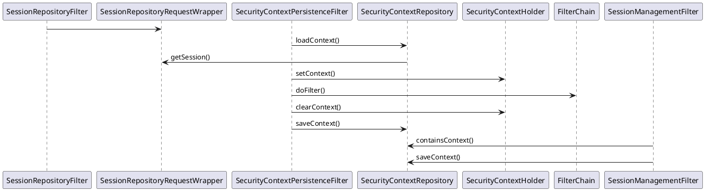

# 3.鱼人守卫(slardar)

大鱼人，是一个水手，他会星星点灯


为SpringMvc(不支持webflux)提供i18n和security,cache,session的基础支持和封装。

 * 工程化Jackson配置(wings-jackson-79.properties)
 * domain继承换肤(通过host判定，且可继承)
 * 多时区，多语言
 * 分布式session和多种认证 - hazelcast
 * 多级cache - caffeine, hazelcast 
 * 特殊功能的filter

## 3.1.Json格式约定(jackson)

考虑到java和js的差异，数据传递和功能上，有以下约定。

 * 浮点数值，以java.BigDecimal与js.string互传。
 * java.null 不输在Json中互传。
 * java.整数，与js.number/string互传。
 * java.日时，包括`util.Date`,`sql.Date`,`time.Local*|Zoned*|Instant`
 * java.日时，以时间戳形式与js.number互传。
 * java.日时，都以`yyyy-MM-dd HH:mm:ss`格式与js.string互传。
 * java.时区，以ZoneId字符串格式与js.string互传。

此外，要注意js的特殊性，和一些宽松的json格式。

 * Json中最好只有2种基本数据类型：boolean,string
 * Js不应该有任何有精度要求的金额计算，只应负责显示服务器端计算结果。
 * 因为时间的特殊性，还有时区和夏令时，在保证精度的同时要提供可读性。
 * 51bits位的long，必须使用string，因为IEE754无法正确表示。
 * 确保jsr310格式兼容，如依赖`jackson-datatype-jsr310`。
 * ZoneId应首选`IANA TZDB`格式，如`America/New_York`。
 * 带时区(`Z`)的序列化与反序列化过程，会丢失夏令时信息。

**Json内容的国际化**，通过注解和类型自动对内容进行i18n转换，以字符串输出。
`I18nString`类型会自动转换。`CharSequence`要`@JsonI18nString`注解才转化。

自动转化时，使用注入的`messageSource`和`WingsI18nContext`获得相应语言。
使用`@JsonI18nString(false)`，可以关闭自动转换。

`R.I<T>`为常用返回值类型，当存在`i18nCode`时，会用i18n信息自动替换`message`。

常用的Jackson注解
 * @JsonRawValue - number不变字符串，字符串不转义。
 * @JsonFormat - 指定格式
 * @JsonIgnore/JsonProperty - 忽略该字段
 * @JsonProperty - 重命名
 * @JsonNaming - 命名规则
 * @JsonRootName(value = "user") - 增加一个头key
 * @JsonUnwrapped - 干掉包装类

[jackson注解](https://github.com/FasterXML/jackson-annotations/wiki/Jackson-Annotations)
[spring定制jackson](https://docs.spring.io/spring-boot/docs/2.4.2/reference/htmlsingle/#howto-customize-the-jackson-objectmapper) - 9.4.3. Customize the Jackson ObjectMapper

Jackson中涉及到泛型，参数类型，必备技能

``` java
TypeReference ref = new TypeReference<List<Integer>>() { };
// TypeFactory 中有很丰富的类型构造
JavaType type = mapper.getTypeFactory().constructCollectionType(List.class, Foo.class)
```

## 3.2.domain继承换肤

不同于反向代理(nginx)的rewrite，此功能是于java的extend和override一致。

* extend - 子domain拥有父domain的全部URL
* override - 子domain可以override父domain的URL
* 子domain有自己独立的URL
* domain的继承基于 host

### 3.2.1.场景举例

假设`a.com`是一个有完整的功能domain，举例包括以下3个URL

 * GET /user-list.json - 基于Controller
 * GET /css/main.css - 静态资源
 * GET /login.html - 基于Controller

此时，来个加盟商`b.com`，除了皮肤，顶级域名外，都和`a.com`一样。  
再后来，`b.com`有了自己的需求，部分界面和url和`a.com`的需求分叉了。
不同的功能自己实现，放在约定的prefix下，此时URL分布如下，

 * GET /login.html - a.com(父)，b.com(子)
 * GET /user-list.json - a.com(父)
 * GET /css/main.css - a.com(父)
 * GET /domain/b/user-list.json - b.com(子)
 * GET /domain/b/css/main.css - b.com(子)

当用户访问以下URL时，按照java的父子类override规则，调用如下，

 * a.com/login.html - /login.html(父)
 * a.com/user-list.json - /user-info.list(父)
 * a.com/css/main.css - /css/main.css(父)
 * b.com/login.html - /login.html(父)
 * b.com/user-list.json - /domain/b/user-list.json(子)
 * b.com/css/main.css - /domain/b/css/main.css(子)

实际项目中，以上场景多发生在resource和controller的Mapping中。

 * resource通常有`**`匹配，用反射ResourceHttpRequestHandler.getResource检查。
 * 若非ResourceHttpRequestHandler且match`**`，需要自己设法检查资源是否存在
 * 暂时不支持viewTemplate，同时也约定模板必须使用全路径。

根据wings mapping约定，避免使用相对路径，所以，b.com要在在class级做前缀。
``` java
@Controller
@RequestMapping("/domain/b")
public class UserController {
 
    @GetMapping("/user-info.json")
    public String fetchUserInfo() {
        // 不支持view，需要手动指定
        return "/domain/b/user-info";
    }
}
```

### 3.2.2.实现原理

在spring mvc体系中，一个请求进入servlet容器后，在worker线程中

* Filter#doFilter `before` chain.doFilter;
* DispatcherServlet#doService `call` doDispatch
* Filter#doFilter `after` chain.doFilter;

wings通过WingsDomainFilter，先检查host，如果是继承域，则构造子域全路径url，  
通过检查缓存和DispatchServlet中的HandlerMapping再构造RequestWrapper。

比如用户访问的URL为 /user/login.json，假设满足domain继承，host为trydofor，
在服务器端实际访问的资源是 /prefix/trydofor/user/login.json

即增加了 /${prefix}/${host}的路径在客户访问URI前。

知识点提示，
* 在FilterChain.doFilter调用之前Request可用，而其后Response可用的，注意线程安全和性能。
* 默认静态资源在classpath中的 `/static`, `/public`, `/resources`, `/META-INF/resources`

## 3.3.多国语和多时区

在silence的配置中，所有I18n有个的资源，放置在 wigns-i18n/即可自动加载

通过`LocaleContextResolver`，按以下优先级，获得当前locale设置。

 1. request被设置好的`WINGS.I18N_CONTEXT`
 2. query string `locale`, `zoneid`
 3. cookie `WINGS_LOCALE`, `WINGS_ZONEID`
 4. http header `Accept-Language`,`Zone-Id`
 5. 系统默认值

此处为行为约定，基于servlet或webflux的具体实现。`WingsLocaleResolver`是一个实现。

用户登录后，自动生成时区和I18n有关的Context。
通过`SecurityContextUtil`获得相关的Context。

`WingsTerminalContext.Context`操作终端有关的，通过TerminalInterceptor完成。

多时区方面，通过enum类，自动生成业务上的标准时区，以供解析和使用。

在编码命名上，类型关系和命名约定如下

 * language - 对应 StandardLanguageEnum
 * timezone - 对应 StandardTimezoneEnum
 * locale - 对应 java.util.Locale
 * zoneid - 对应 java.time.ZoneId
 
在@Valid的验证中，有以下技巧。

```
@Size( min = 5, max = 14, message = "{common.email.size}")
# 在 i18n信息中设置
common.email.size=The author email '${validatedValue}' must be between {min} and {max} characters long
```

## 3.4.Session和认证管理

 * 同时支持header-token, cookie-session
 * 安全不高的url-string的凭证类ticket。
 * 用户可管理session，控制登录，踢人
 * 可配置的cookie-name，token-name
 * 不同级别的控制并发登录，如财务只许单登录。
 * 集成第三方登录，验证码登录，凭证登录
 * 管理端马甲，超级用户身份切换
 * session别名，附加token

### 3.4.1.同时使用header和cookie

通过spring默认的server.servlet.session.cookie.name设置，
在WingsSessionIdResolver中，会加入header和cookie两个resolver。
header的名字和cookie同名，默认是SESSION。

建议不使用rememberMe，设置session的timeout和cookie的maxAge较长时间。

### 3.4.2.多中验证及绑定登录

加强了spring security的userPassword登录，通过继承或替换以下类，实现无缝替代。

 * WingsBindLoginConfigurer : FormLoginConfigurer
 * WingsBindAuthenticationToken : UsernamePasswordAuthenticationToken
 * WingsBindAuthenticationFilter : UsernamePasswordAuthenticationFilter
 * WingsBindAuthenticationProvider : DaoAuthenticationProvider
 * WingsUserDetail : UserDetails
 * WingsUserDetailService : UserDetailsService

使用时，建议直接以bindLogin替换formLogin配置，如果共存，则必须bind的order在前面，
因为Token是继承关系，要保证WingsProvider在DaoAuthenticationProvider前处理。

举例，实现短信验证或第三方绑定时，只需实现WingsUserDetailService，处理验证类型。
 
 * 短信验证，UserDetailsService在缓存中取得passwordEncoder加密后的短信
 * 三方绑定，推荐集成justAuth，设置loginProcessingUrl为callback地址，通过
   - 在AuthnDetailsSource构造的请求中的Authentication.details
   - 在AuthnProvider先UserDetailsService.load，NotFound时尝试创建用户
   - 尤其Oauth这种2次获取detail的，强依赖AuthnDetailsSource获取Detail
   
在使用 WingsBindAuthnProvider 代替默认的DaoAuthenticationProvider时，有2种方法，

* 继承configure(AuthenticationManagerBuilder)，通过wingsHelper手动构建
* 无上述继承，直接 @Bean WingsBindAuthnProvider，自动全局配置（推荐）
* 无AuthenticationProvider，有WingsUserDetailsService，自动配置Wings全套（默认）

当手动配置userDetailsService，和默认配置一样，会自动new一个Provider添加。
如果不需要添加Provider，可设置wingsBindAuthnProvider(false)，与spring原始不同。


### 3.4.4.实现原理

在spring session加持下，spring security可以完成api预授信和token登录

 * [PreAuthenticatedProcessingFilter](https://docs.spring.io/spring-security/site/docs/current/reference/html5/#servlet-preauth)
 * [UsernamePasswordAuthenticationFilter](https://docs.spring.io/spring-security/site/docs/current/reference/html5/#servlet-preauth)
 * SwitchUserFilter - linux su - 全局套马甲
 * RunAsManager - 单方法临时套马甲

作为提高话题，以下技术点需要阅读源码和定制。

* SessionRepositoryFilter
* UsernamePasswordAuthenticationFilter
* RememberMeAuthenticationFilter
* SwitchUserFilter
* FilterComparator

类似 DigestAuthenticationFilter

RunAsManager - 有意思，调查一下，好像可以马甲

Session和SecurityContext的调用关系如下


### 3.4.1.区分cookie，使用别名

同domain同path下，多个应用共享一套Session-cookie体系，希望同名cookie可以区分使用。
如admin和front两个应用要区分出`SESSSION`的cookie，设置别名而无需修改session体系。

实现原理是写入时定制CookieSerializer，读取时进行cookie-name转换。


### 3.4.5.hazelcast 管理

* ClassNotFound - user-code-deployment需要设置
* 重连机制，client时，需要设置重连时间
* 数据持久化，MapStore和MapLoader
* 默认开启multicast，组播地址224.0.0.1

在实际部署时，建议独立配置好hazelcast集群，使用client端链接。
集群配置，可以是app+1的形式，这样可保证至少一个独立存活。

一般在统一网段，内网间可以使用组播，但建议使用tcp-ip方式设置。
通过 spring.hazelcast.config 选择不同的配置文件，建议xml。

hazelcast 3.x和4.x差异很大，也就是在spring-boot 2.2和2.4是不兼容的。

hazelcast提供了3类锁，推荐使用CP系统，但集群要求至少3台，默认为0单机unsafe模式。

 * FencedLock - Raft的分布式锁，在CP系统(4.x)
 * IMap.lock - 自动GC，干净简洁
 * ILock.lock - 遵循j.u.c.Lock约定（3.12移除）

参考资料如下，

 * https://hazelcast.com/blog/hazelcast-imdg-3-12-introduces-cp-subsystem/
 * https://hazelcast.com/blog/long-live-distributed-locks/

### 3.4.6.其他

RequestContextHolder
SecurityContextHolder

CookieSerializer
HttpSessionIdResolver

SessionEventHttpSessionListenerAdapter
HttpSessionEventPublisher

rememberMe
SpringSessionRememberMeServices


默认使用Hazelcast实现，全默认配置，正式环境需要自行调整

若使用`@Enable*HttpSession`表示手动配置，则`spring.session.*`不会自动配置。 
`springSessionRepositoryFilter`会置顶，以便wrap掉原始的HttpRequest和HttpSession

## 3.5.缓存Caffeine和Hazelcast

默认提供JCache约定下的Memory和Server两个CacheManager，名字和实现如下，

* MemoryCacheManager caffeineCacheManager
* ServerCacheManager hazelcastCacheManager

因为已注入了CacheManager，会使spring-boot的自动配置不满足条件而无效。
If you have not defined a bean of type CacheManager or 
a CacheResolver named cacheResolver (see CachingConfigurer), 
Spring Boot tries to detect the following providers (in the indicated order):

三种不同缓存级别前缀，分别定义不同的ttl,idle,size

* `program.` - 程序级，程序或服务运行期间
* `general.` - 标准配置，1天
* `service.` - 服务级的，1小时
* `session.` - 会话级的，10分钟

具有相同前缀的cache，会采用相同的配置项(ttl,idle,size)。

``` java
@CacheConfig(cacheManager = Manager.Memory, 
cacheNames = Level.GENERAL + "OperatorService")

@Cacheable(key = "'all'", 
cacheNames = Level.GENERAL + "StandardRegion", 
cacheManager = Manager.Server)

@CacheEvict(key = "'all'", 
cacheNames = Level.GENERAL + "StandardRegion", 
cacheManager = Manager.Server)
```

对于hazelcast的MapConfig若无配置，则wings会根据level自动配置以下MapConf。
``` xml
<time-to-live-seconds>3600</time-to-live-seconds>
<max-idle-seconds>0</max-idle-seconds>
<eviction size="5000"/>
```

## 3.6.有个时区的LocalDateTime和ZonedDateTime

多时区，要兼顾数据可读性和编码便利性，在slardar中统一约定如下。

* `系统时区` - 系统运行时区，其在Jvm，Db上是统一的。
* `数据时区` - 数据流动时，参与者所在的时区。
* `用户时区` - 数据使用者，阅读数据时希望看到的时区。

在一般情况下，此三者是统一的，比如都在北京时间，GMT+8。
在时区不敏感的数据上，一般直接使用LocalDateTime，忽略时区。

在slardar的适用的业务场景中，在业务层统一使用系统时区，用LocalDateTime。
而在Controller层，负责进行系统和用户时区的双向转换，使用ZonedDateTime。

* 时区不敏感或只做本地时间标签的情况，统一使用LocalDateTime，
* 时区敏感时，使用ZonedDateTime类型，在Jackson和RequestParam中自动转换。
  - Request时，自动把用户时间调至系统时区。
  - Response时，自动把系统时间调至用户时区。

注意，因util.Date的缺陷，在wings中，默认禁用其使用，需要使用java.time.*

## 3.7.常用功能

## 3.7.1.restTemplate和okhttp

默认使用okhttp3作为restTemplate的实现。按spring boot官方文档和源码约定。
并可以 Autowired OkHttpClient 直接使用，默认**信任所有ssl证书**，如安全高，需要关闭。
如果需要按scope定制，使用RestTemplateBuilder，全局应用使用RestTemplateCustomizer。

[RestTemplate 定制](https://docs.spring.io/spring-boot/docs/2.4.2/reference/htmlsingle/#boot-features-resttemplate-customization)
org.springframework.boot.autoconfigure.web.client.RestTemplateAutoConfiguration

在springboot默认是3.x，而just-auth需要4.x，所以需要手动okhttp3.version属性

## 3.7.2.防止连击

通常业务场景下，可以通过前端在dom或js层面做好用户的防连击。而服务器端防连击，主要是API类的误操作。
因filter和interceptor会对所有请求检查，slardar采用的是AOP方式，类似Cacheable。

沿用dota命名，此处命名为 @DoubleKill注解，通过Jvm全局锁和DoubleKillException完成。

在controller层，需要使用@RequestParam 或@RequestHeader等注入参数。
对应session级别的控制，可使用@bean进行处理。

默认对DoubleKillException返回固定的json字符串，注入DoubleKillExceptionResolver可替换

详细用法，可参考TestDoubleKillController和DoubleKillService

## 3.7.3.验证码

对于受保护的资源，要采取一定的验证码，有时是为了延缓时间，有时是为了区分行为。
验证码可以header或param进行校验（默认param）去请求验证码图片等。

在spring Security中，对401和403有以下约定，所以验证码使用406

* 401 - Unauthorized 身份未鉴别
* 403 - Forbidden/Access Denied 鉴权通过，授权不够

slardar验证码的默认是基于图片的，在现今的AI算法识别上，识别成功率应该在90%以上。
因此，仅限于初级的防人工的资源保护上。若是敏感信息或高级防护，建议采购第三方验证码服务。

默认支持中文验证码，一般是一个汉字，3个英数，可以在配置中关闭。

使用方法如下，在MappingMethod上，放置`@FirstBlood` 即可，工作流程如下。

* 客户端正常访问此URL，如/test/captcha.json
* 服务器需要验证码时，以406(Not Acceptable)返回提示json
* 客户端在header和cookie中获得client-ticket的token，并每次都发送
* 客户端在URL后增加fresh-captcha-image=${timestamp}获取验证码图片（可直接使用）
* 客户端在URL后增加check-captcha-image=${vcode}提交验证码
* 服务器端自动校验client-ticket和check-captcha-image，完成验证或放行

若需集成其他验证码，如第三方服务或消息验证码，实现并注入FirstBloodHandler即可

### 3.7.4.终端信息

通过handlerInterceptor，在当前线程和request中设置terminal信息

TerminalContext保存了，远程ip，agent信息，locale和timezone

## 3.8.特别用途的 Filter

## 3.8.1.OverloadFilter过载

是否限定请求并发，默认`spring.wings.slardar.enabled.overload=false`

 * 自动或手动设置`最大同时进行请求数`。超过时，执行`fallback`。
 * 不影响性能的情况下，记录慢响应URI和运行状态。
 * 优雅停止服务器，阻断所有新请求。
 * 相同IP请求过于频繁，执行fallback。

`最大同时进行请求数`，指已经由Controller处理，但未完成的请求。

其中，关闭`快请求`或`慢请求`功能，可以通过以下设置关闭，

 * `快请求` - `wings.slardar.overload.request-capacity=-1`
 * `慢请求` - `wings.slardar.overload.response-warn-slow=0`


## 3.9.常见问题

### 01.Error creating bean with name 'hazelcastInstance'

Invalid content was found starting with element 'cluster-name'，
若是有以上信息，是hazelcast 3.x和4.x配置的兼容问题，boot-2.2.x为hazelcast 3.12.x


### 02.修改过的默认配置

slardar，使用undertow，并提供了一下默认配置

### 03.session方案的选择

其实 hazelcast 是个不错的选择，若选用redis，切记redis必须`requirepass`。
最后，从redis+redisson的方案，切换成了 hazelcast的方案。其理由如下。

* 单应用进化的简单性，hazelcast是零依赖
* 性能，可用性，运维角度，两者五五开

关于hazelcast和spring，主要的管理场景是cache,session,security

* spring-boot优先尝试创建client，不成则创建embedded server
* spring session 使用@Enable*HttpSession手动配置。文档中是hazelcast3的配置，实际支持4

文档中的例子都是通过编码方式配置的，实际可以通过xml配置，交由boot处理。
系统默认提供了server和client的组播配置。

### 04.error处理，需要自定义page或handler

需要根据spring约定和实际需要，自定义一套机制。
但是不要使用`spring.mvc.throw-exception-if-no-handler-found=true`，
因为，异常之所以叫异常，就不能当做正常，避免用来处理正常事情。

 * controller层异常用`@ControllerAdvice` 和 `@ExceptionHandler`
 * service层异常，自行做业务处理，或AOP日志
 * 静态，src/main/resources/public/error/404.html
 * 模板，src/main/resources/templates/error/5xx.ftlh
 * `class MyErrorPageRegistrar implements ErrorPageRegistrar`

```
@ControllerAdvice(basePackageClasses = AcmeController.class)
public class AcmeControllerAdvice extends ResponseEntityExceptionHandler
// ///////
public ModelAndView resolveErrorView(HttpServletRequest request,
```

[error-handling](https://docs.spring.io/spring-boot/docs/2.4.2/reference/htmlsingle/#boot-features-error-handling)

### 05.undertow 启动时warn UT026010

在未配置websocket时，undertow使用默认buffer，出现以下警告。
需要定制`websocketServletWebServerCustomizer`，或设置
`spring.wings.slardar.enabled.undertow-ws=true`即可

在`io.undertow.websockets.jsr.Bootstrap` 68行，`buffers == null` 时
`UT026010: Buffer pool was not set on WebSocketDeploymentInfo, the default pool will be used`
默认 DefaultByteBufferPool(directBuffers, 1024, 100, 12);

### 06.OAuth2的参考资料

* [OAuth 2 Developers Guide](https://projects.spring.io/spring-security-oauth/docs/oauth2.html)
* [OAuth2 boot](https://docs.spring.io/spring-security-oauth2-boot/docs/current/reference/htmlsingle/)
* [Spring Security](https://docs.spring.io/spring-security/site/docs/current/reference/htmlsingle/)

### 07.如何配置security

security一定是系统中最为重要的部分，也是所有渗透入侵的重点，所以slardar无默认配置。

配置中可以使用Order，提供多个HttpSecurity。

### 08.多线程下的SecurityContext

 * DelegatingSecurityContext*  
 * transmittable-thread-local

### 09.成功登陆后跳转

SavedRequestAwareAuthenticationSuccessHandler和RequestCache 进行搭配即可。
在前后端分离的情况下，不需要后端控制，所以应该关闭RequestCache。

 * HTTP Referer header - 有些浏览器不给refer
 * saving the original request in the session - 要session支持。
 * base64 original URL to the redirected login URL - 通常的SSO实现

不过，spring security默认不支持地三种。如果要定制的话，需要看ExceptionTranslationFilter，
在sendStartAuthentication方法中，对requestCache或authenticationEntryPoint上进行定制。
也可以通过interceptor对loginPage进行定制。

* https://www.baeldung.com/spring-security-redirect-login
* https://www.baeldung.com/spring-security-redirect-logged-in
